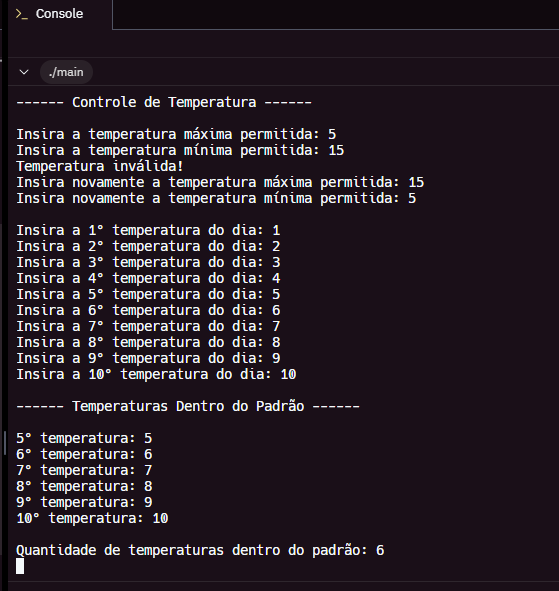
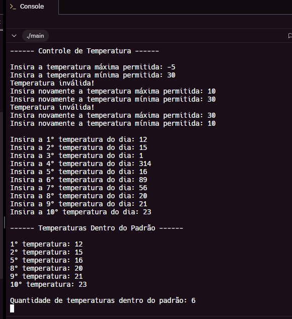
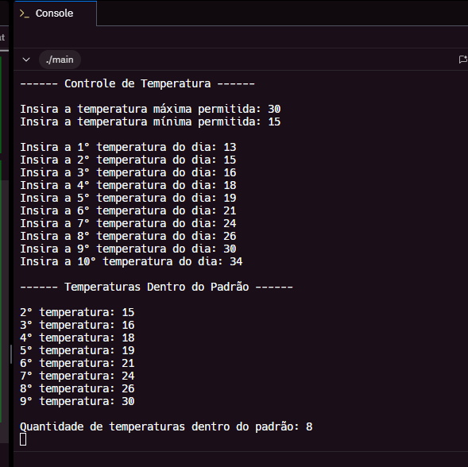

# 🌡️ Projeto: Filtro de Temperaturas em C

Este projeto é um programa simples feito em linguagem C.

## 📋 O que ele faz?

- Solicita 10 temperaturas do usuário  
- Solicita os limites mínimo e máximo de uma faixa ideal  
- Mostra quais temperaturas estão dentro da faixa  
- Informa a quantidade total dentro da faixa ideal

## 🖥️ Resultado

Abaixo está um exemplo de execução do programa:

